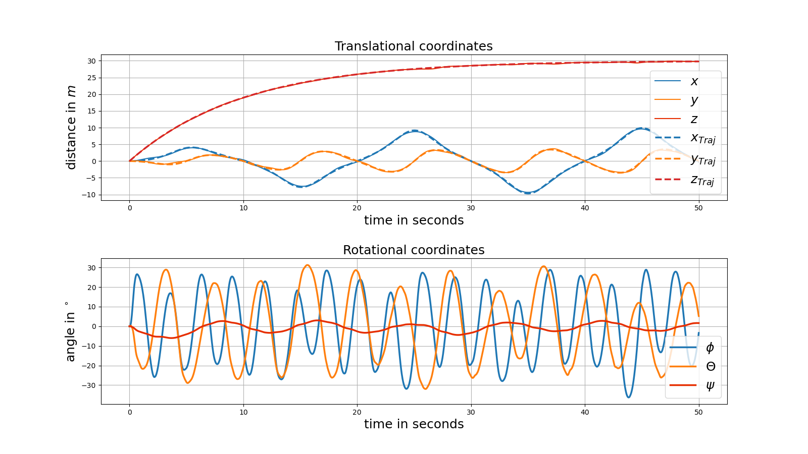

# Control and State Estimation of Quadrotor UAV under Wind Disturbance (HITSZ: Optimal Estimation, Fall 2024)

本项目基于哈尔滨工业大学（深圳）最优估计研究生课程（2024 Fall）大作业，完成了如下目标：

1. 利用 Euler-Lagrange 方程建立四旋翼无人机动力学模型以及状态空间表达式
2. 对无人机在悬停态线性化，构造轨迹跟踪的含状态和控制约束的 MPC 问题，并调用 OSQP 求解
3. 添加风力扰动，分别用 EKF 和 UKF 进行状态与三轴风力的估计并引入控制策略中尝试消除，实现了轨迹跟踪问题的自适应非线性动态反演控制

## 无人机物理参数

| **无人机参数** | **值**                | **单位** |
|----------------|-----------------------|----------|
| $m$            | 0.468                 | kg       |
| $l$            | 0.225                 | m        |
| $I_x$          | 4.856                 | g·m^2   |
| $I_y$          | 4.865                 | g·m^2   |
| $I_z$          | 8.801                 | g·m^2   |
| $K_f$          | $2.980 \times 10^{-3}$| kgm      |
| $K_m$          | $1.490 \times 10^{-3}$| kgm^2  |
| $A$            | 0.01                  | Ns/m     |

## 状态空间表示

状态方程为：

其中，状态向量 $\mathbf{x}$ 定义为：

$$
\mathbf{x} = 
\begin{bmatrix}
\xi^T & \dot{\xi}^T & \eta^T & \dot{\eta}^T
\end{bmatrix}^T \in \mathbb{R}^{12}
$$

### 参考曲线轨迹

仿真中使用的参考轨迹是伯努利双纽线，其数学表达式如下：

$$
x = \frac{A\cos\left(wt - \frac{\pi}{2}\right)}{\left(1 + \sin^2\left(wt - \frac{\pi}{2}\right)\right)\left(1 - e^{-\frac{t}{\tau}}\right)}
$$

$$
y = \frac{A\sin\left(wt - \frac{\pi}{2}\right)\cos\left(wt - \frac{\pi}{2}\right)}{\left(1 + \sin^2\left(wt - \frac{\pi}{2}\right)\right)\left(1 - e^{-\frac{t}{\tau}}\right)}
$$

$$
z = B\left(1 - e^{-\frac{t}{\tau}}\right)
$$

其中，A=10 m，B = 30 m，w = $\frac{\pi}{10}$，$\tau$=10

### 风力扰动

对于风干扰，假设在各轴方向的风力如下：

$$
F_{\text{xwind}} = a_x \sin\left(\frac{24\pi t}{50}\right) \, \mathrm{N}
$$

$$
F_{\text{ywind}} = a_y \sin\left(\frac{36\pi t}{50}\right) \, \mathrm{N}
$$

$$
F_{\text{zwind}} = 0 \, \mathrm{N}
$$

其中，设置 $a_x$ = 2, $a_y$ = 2；

### 观测噪声

在观测过程中，我们引入了一定的噪声模型，以更贴近真实的实验环境。假设观测噪声与观测值的大小成比例，同时遵循正态分布，其数学表达如下：

$$
\epsilon = \alpha \cdot y_{\text{true}} \cdot \mathcal{N}(0, \sigma^2)
$$

$$
y_{\text{noisy}} = y_{\text{true}} + \epsilon
$$

其中：
- $\alpha$ 为噪声比例因子，表示噪声的相对强度；
- $\mathcal{N}(0, \sigma^2)$ 表示均值为 0、方差为 $\sigma^2$ 的正态分布；
- $y_{\text{true}}$ 为真实观测值。

该模型能够模拟真实观测中不可避免的误差，同时通过参数 $\alpha$ 和 $\sigma^2$ 控制噪声强度和分布特性，使得模型更具有鲁棒性和现实性。在本文中 $\alpha=0.1$，$\sigma=0.03$。

## 环境依赖

本次实验与仿真运行在以下硬件与软件环境：

- **Python版本**：Python 3.8
- **主要依赖库**：
    - NumPy 1.24.4
    - SciPy 1.10.1
    - Matplotlib 3.7.3
- **操作系统**：Ubuntu 20.04
- **处理器**：Intel Core i9

## 仿真结果

### 1. MPC跟踪（无状态约束）

**状态**:

**动画**:

### 2. MPC跟踪（含状态约束）

$$
v_{z_{\text{min}}} = -1.5
$$

$$
v_{z_{\text{max}}} = 1.5
$$

**状态**:

**动画**:

### 3. EKF

**状态**:

**控制**:

**状态估计**:

**风力估计**:

**动画**:

### 4. UKF

**状态**:

**控制**:

**状态估计**:

**风力估计**:

**动画**:

